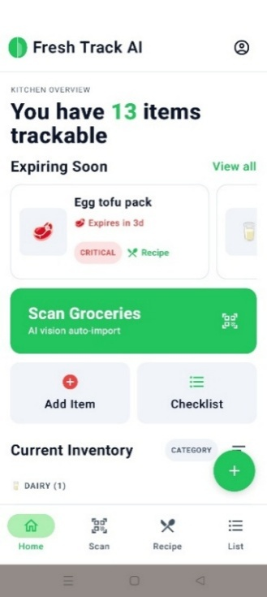
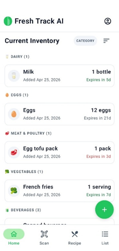
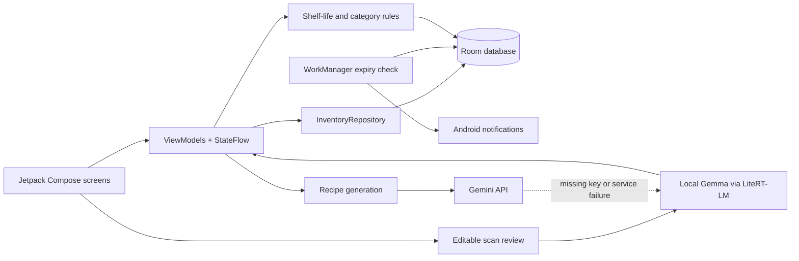

<div align="center">

# 🥬 FreshTrack AI

**A local-first Android companion for tracking groceries, catching expiry risks, planning recipes, and turning missing ingredients into a shopping list.**


</div>

## 🎯 Why FreshTrack?

Groceries are easy to forget once they reach the fridge or pantry. FreshTrack keeps the inventory visible, highlights items that need attention, and helps reuse available ingredients before buying more.

## ✨ What It Does

- Maintains an offline inventory with quantities, categories, dates, expiry status, and notes.
- Supports manual entry plus editable review flows for food images, receipts, and nutrition labels.
- Sorts inventory by expiry or name and separates fresh, watch, critical, and expired items.
- Runs a daily `WorkManager` check and posts expiry notifications.
- Generates recipes from the current inventory through Gemini, with local Gemma fallback.
- Adds missing recipe ingredients to a persistent shopping list and merges duplicates.
- Stores inventory, shopping items, and cached recipe results locally.
- Lets users configure a Gemini API key and import or download a compatible local Gemma model at runtime.

## 📱 Verified App Views

The screens below are captured from the Android app with synthetic grocery data.

| Dashboard | Inventory |
|---|---|
|  |  |

## 🧭 Architecture



The UI observes `StateFlow` data exposed by ViewModels. Repositories isolate Room access, while AI providers keep cloud and on-device inference paths separate from inventory persistence.

## 🧰 Technology

| Area | Implementation |
|---|---|
| UI | Kotlin, Jetpack Compose, Material 3 |
| State | Android ViewModel, Kotlin Coroutines, `StateFlow` |
| Persistence | Room, DAO interfaces, repository layer |
| Background work | WorkManager, Android notifications |
| Cloud AI | Google Gemini Android SDK |
| On-device AI | Gemma through Google AI Edge LiteRT-LM |
| Media | Camera/gallery document access, Coil |
| Testing | JUnit, coroutine test utilities, AndroidX test libraries |

## 🚀 Run Locally

### Requirements

- Android Studio with JDK 17+
- Android SDK 36
- Android device or emulator running Android 8.0+

```powershell
# Build the debug APK
.\gradlew.bat :app:assembleDebug

# Run local unit tests
.\gradlew.bat :app:testDebugUnitTest
```

Open the project in Android Studio, select the `app` configuration, and run it on a device or emulator. Core inventory and shopping-list features work without an API key.

For AI features:

1. Import or download a compatible `.litertlm` Gemma model from Profile Settings.
2. Add and validate a Gemini API key only when cloud recipe or estimation support is needed.
3. Keep API keys and model binaries outside version control.

## ✅ Validation and Boundaries

- Unit coverage includes repository behavior, sorting, dashboard data, expiry calculations, scan mapping, Gemini runtime handling, model downloads, and recipe generation.
- Food-image extraction and receipt parsing use the configured local Gemma model; they are unavailable until a compatible model is installed.
- Gemini calls require network access and a user-supplied key. Recipe generation can fall back to Gemma when the cloud path is unavailable.
- Room is the source of truth for app data. There is no account system, cloud synchronization, or cross-device backup.
- Database migrations currently use destructive fallback, so schema upgrades can clear local data.
- AI output remains reviewable and should not be treated as authoritative nutrition or food-safety advice.

## 📄 License

Released under the [MIT License](LICENSE).
